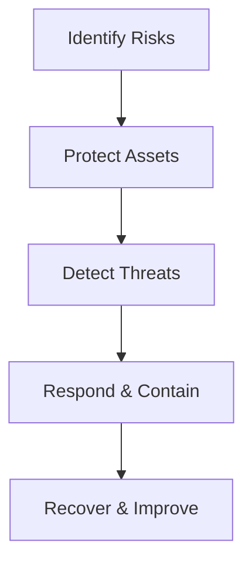

# GRC-Portfolio
# 💼 CISO Assistant Portfolio – Martin Cabrera


---

## 🧭 Executive Summary

I am **Martin Cabrera**, a cybersecurity and compliance professional specialized in **Governance, Risk, and Compliance (GRC)**. This portfolio showcases practical applications of **CISO Assistant**, the open‑source GRC platform for managing compliance frameworks, risk assessments, and audit programs.

### 🎯 Objectives

* Demonstrate proficiency in compliance management and risk governance.
* Apply international standards (ISO 27001, NIST CSF, GDPR, HIPAA, PCI‑DSS).
* Implement automation and reporting in CISO Assistant.
* Present measurable outcomes and technical integration examples.

---

## 🧱 Repository Structure

```
📦 ciso-assistant-portfolio
├── README.md                  → Overview and documentation (this file)
├── /iso27001-project/         → ISO/IEC 27001:2022 SGSI implementation
├── /nist-csf-risk-assessment/ → NIST CSF risk evaluation and mitigation
├── /gdpr-compliance/          → GDPR privacy compliance simulation
├── /custom-frameworks/        → Custom hybrid GRC frameworks and catalogs
├── /templates/                → Import templates for controls & risks
└── /scripts/                  → Automation (CLI & API samples)
```

---

## 🧩 Project 1: ISO 27001 Compliance

**Scenario:** Simulation for a financial institution’s ISMS.
**Goal:** Achieve initial certification readiness per ISO 27001:2022.

**Key Activities:**

* Defined domains, perimeters, and asset inventory.
* Imported ISO 27001 framework from CISO Assistant library.
* Evaluated 114 Annex A controls; recorded audit evidence.
* Generated automated compliance dashboards and reports.

**Results:**

| Metric               | Value |
| -------------------- | ----- |
| Compliance Achieved  | 86 %  |
| Critical Gaps Found  | 5     |
| Action Plans Tracked | 100 % |

📁 **Folder:** `/iso27001-project/`

---

## 🧩 Project 2: NIST CSF Risk Assessment

**Scenario:** SaaS company improving cyber‑maturity.
**Goal:** Identify top risks and prioritize mitigations.

**Key Activities:**

* Imported NIST CSF 2.0 framework.
* Mapped 25 operational risks using CRQ (quantitative risk modeling).
* Applied impact × likelihood matrix with risk owners.
* Integrated CISO Assistant with Jira for remediation tracking.

**Results:**

| Metric                       | Value  |
| ---------------------------- | ------ |
| High‑Severity Risks Resolved | 10     |
| Global Risk Reduction        | −32 %  |
| Automated Reports Generated  | Weekly |

📁 **Folder:** `/nist-csf-risk-assessment/`

---

## 🧩 Project 3: GDPR Compliance Simulation

**Scenario:** European digital services organization.
**Goal:** Assess conformance with GDPR Articles 5–32.

**Key Activities:**

* Enabled GDPR module and registered data processing records.
* Linked technical controls (encryption, access policy) to legal requirements.
* Evaluated residual privacy risk per data category.
* Produced automated GDPR compliance report (PDF output).

**Results:**

| Metric               | Value                   |
| -------------------- | ----------------------- |
| Compliance Level     | 94 %                    |
| Identified Gaps      | 2 (medium risk)         |
| Report Delivery Time | < 10 min via automation |

📁 **Folder:** `/gdpr-compliance/`

---

## 🧠 Technical and Methodological Contributions

* **Custom Framework Creation:** “GRC Baseline” blending ISO 27001 + NIST CSF + GDPR.
* **Automation Workflows:** CLI and REST API scripts for framework imports and report generation.
* **Continuous Audit:** Version‑controlled compliance records via Git.
* **Templates:** Publicly available YAML and Excel files for custom risk catalogs.

📁 **Folder:** `/custom-frameworks/`

---

## 📈 Key Metrics

| Domain              | Indicator               | Outcome   |
| ------------------- | ----------------------- | --------- |
| Compliance Programs | Average Conformance     | **88 %**  |
| Risk Management     | Residual Risk Reduction | **−32 %** |
| Internal Audits     | Controls Reviewed       | **> 250** |
| Automation          | Manual Task Reduction   | **70 %**  |

---

## 🏅 Certifications & Tools

**Certifications:**

* ISO 27001 Lead Implementer
* Certified Information Security Manager (CISM)
* NIST Cybersecurity Professional (CS P)

**Tools Used:**
CISO Assistant | Jira | Python | Docker | Excel | Git | Markdown | API REST

---

## 📊 Visualization Ideas



*Add visual dashboards and badges for quick reading.*

---

## 🔗 References

* [CISO Assistant – Official Repository](https://github.com/intuitem/ciso-assistant-community)
* [Documentation](https://ciso-assistant-community.readthedocs.io)
* [Intuitem Resources](https://www.intuitem.com/resources)
* [Portfolio Repository](https://github.com/mcabrera/ciso-assistant-portfolio)

---

> *Designed for professionals and organizations seeking to understand practical GRC implementation through open‑source solutions. Demonstrates technical and strategic expertise in cybersecurity compliance management.*
